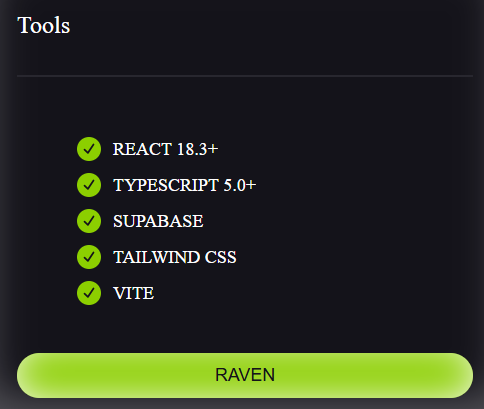
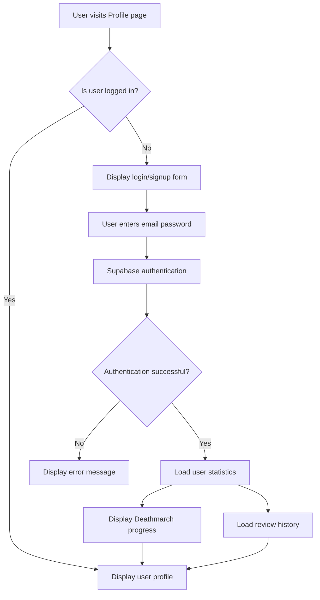
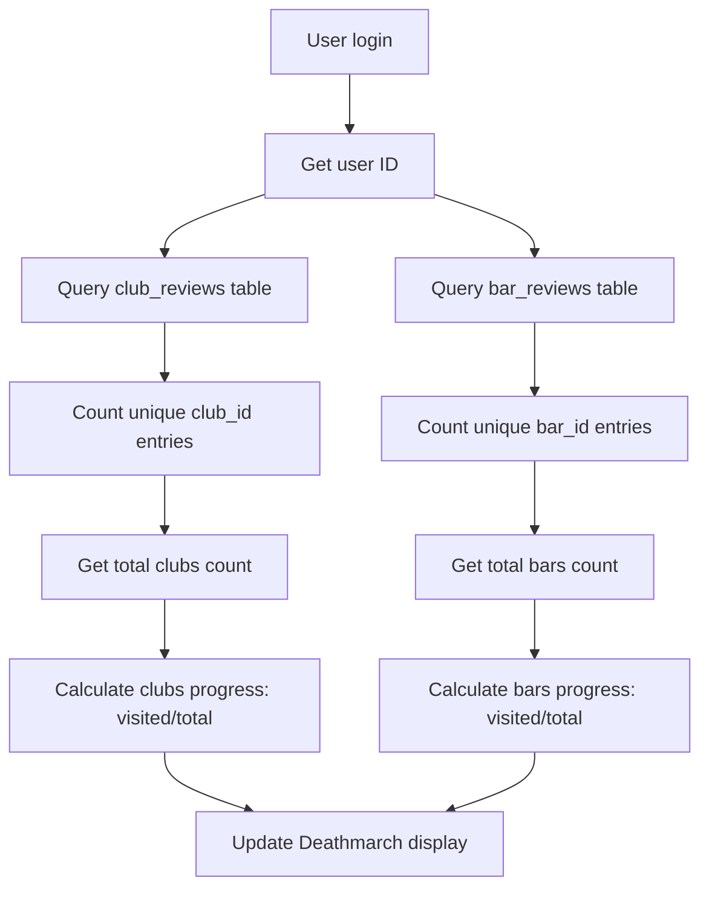

# 🌃 RAVEN - Berlin Nightlife Discovery Platform

<div align="center">
  

  **Discover. Experience. Transcend.**

  *The ultimate platform for exploring Berlin's underground nightlife scene*
</div>

<div align="center">
  
</div>


---

## 📖 Project Overview

**RAVEN** is a modern web application specifically designed for Berlin's nightlife culture, providing an immersive club and bar discovery experience. The project adopts a poetic design language, reimagining traditional venue rating systems as an emotionally resonant digital nightlife ecosystem.

### 🎯 Core Vision
- **Discover**: Explore Berlin's most distinctive nightlife venues
- **Experience**: Record and share authentic nightlife experiences
- **Transcend**: Motivate users to explore more venues through the "Deathmarch" progress system

### 🛠️ Technology Stack

#### Frontend Technologies
- **React 18.3+** - Modern user interface framework
- **TypeScript 5.0+** - Type-safe JavaScript superset
- **Vite** - High-performance frontend build tool
- **Tailwind CSS** - Utility-first CSS framework
- **Framer Motion** - Smooth animation library
- **React Router** - Client-side routing management
- **Lucide React** - Modern icon library

#### Backend & Database
- **Supabase** - Full-stack backend-as-a-service platform
  - PostgreSQL database
  - Real-time data synchronization
  - User authentication & authorization
  - Row Level Security (RLS)
  - Automatic API generation

#### Development Tools
- **ESLint** - Code quality checking
- **PostCSS** - CSS post-processor
- **Git** - Version control system

---

## ✨ Core Features & Highlights

### 🎵 Venue Discovery System
- **Dual Classification**: Support for both Clubs and Bars venue types
- **Smart Filtering**: Multi-dimensional filtering based on districts, themes, and styles
- **Dynamic Ratings**: Real-time rating system based on user reviews
- **Tag System**: Rich theme categorization (music, vibe, architecture, drinks, etc.)

**Target Users**: Berlin nightlife enthusiasts, tourists, local residents
**Problems Solved**: Scattered information, lack of trustworthy reviews, difficulty discovering new venues

### 🌟 User Review System
- **Anonymous Reviews**: Privacy-protecting anonymous review mechanism
- **Multi-dimensional Ratings**: 
  - Clubs: Music, Vibe, Crowd, Safety (0-100 scale)
  - Bars: Quality, Vibe, Price, Friendliness (0-100 scale)
- **Optimistic Updates**: Immediate display on detail pages after review submission
- **Rating Aggregation**: Automatic calculation of venue average ratings

**Target Users**: Users with nightlife experience
**Problems Solved**: Lack of authentic reviews, single-dimensional rating systems

### 🏆 Deathmarch Progress System
- **Gamified Experience**: "Every venue visited brings you closer to transcendence"
- **Dynamic Statistics**: Real-time display of user visit progress (e.g., 5/128 clubs, 12/342 bars)
- **Achievement Motivation**: Encourages users to explore more venues

**Target Users**: Heavy nightlife users, collection enthusiasts
**Problems Solved**: Lack of continuous exploration motivation

### 📱 Personal Profile System (ID)
- **Minimalist Identity**: Redefined user profile concept
- **Echo Memory**: Paginated display of user review history
- **Graveyard Archive**: Favorites and historical record management
- **Real-time Statistics**: Dynamic display of personal nightlife footprint

**Target Users**: All registered users
**Problems Solved**: Lack of appeal in traditional user profile pages

### 🔒 Security & Privacy
- **Supabase Authentication**: Secure user registration and login
- **Anonymous Reviews**: Protection of user identity privacy
- **Row Level Security**: Database-level permission control
- **Data Encryption**: Secure storage of sensitive information

**Target Users**: All users
**Problems Solved**: Privacy breach risks, data security

---

## 📁 Directory Structure

```
E:\RAVEN\
├── public/                     # Static resource files
│   ├── favicon.ico            # Website icon
│   └── index.html             # HTML template
├── src/                       # Source code directory
│   ├── components/            # Reusable components
│   │   ├── ui/               # Basic UI components
│   │   │   ├── Button.tsx    # Button component
│   │   │   ├── Card.tsx      # Card component
│   │   │   └── Badge.tsx     # Badge component
│   │   ├── Avatar.tsx        # Avatar component
│   │   ├── Navigation.tsx    # Navigation component
│   │   ├── RatingBar.tsx     # Rating bar component
│   │   ├── VibeCard.tsx      # Vibe card component
│   │   └── WordStreamReviews.tsx # Review stream component
│   ├── contracts/            # Type definitions
│   │   └── types.ts          # TypeScript type interfaces
│   ├── lib/                  # Utility libraries
│   │   ├── supabase.ts       # Supabase client configuration
│   │   └── utils.ts          # Common utility functions
│   ├── routes/               # Route pages
│   │   ├── Landing.tsx       # Homepage
│   │   ├── Core.tsx          # Core functionality page
│   │   ├── Clubs.tsx         # Clubs listing page
│   │   ├── ClubDetail.tsx    # Club detail page
│   │   ├── Bars.tsx          # Bars listing page
│   │   ├── BarDetail.tsx     # Bar detail page
│   │   ├── Profile.tsx       # User profile page
│   │   └── SubmitReview.tsx  # Review submission page
│   ├── services/             # Business logic layer
│   │   ├── clubsService.ts   # Club-related services
│   │   ├── barsService.ts    # Bar-related services
│   │   ├── reviewsService.ts # Review-related services
│   │   ├── vibeService.ts    # Vibe-related services
│   │   └── favoritesService.ts # Favorites-related services
│   ├── styles/               # Style files
│   │   ├── index.css         # Global styles
│   │   └── raven-bottom-nav.css # Bottom navigation styles
│   ├── App.tsx               # Main application component
│   └── main.tsx              # Application entry file
├── sql/                      # Database scripts
│   ├── bars_v2_00_create_all_bar_tables.sql # Bar-related table creation
│   ├── bars_v2_01_create_bars_table.sql     # Bar main table
│   ├── bars_v2_02_create_bar_ratings_table.sql # Bar ratings table
│   ├── bars_v2_03_create_bar_reviews_table.sql # Bar reviews table
│   ├── bars_v2_04_extend_themes_table.sql      # Theme table extension
│   ├── bars_v2_05_create_bar_themes_table.sql  # Bar themes association table
│   ├── bars_v2_06_create_bar_locations_table.sql # Bar locations table
│   ├── bars_v2_07_seed_data.sql               # Seed data
│   └── bars_v2_08_fix_view_rls.sql            # View permission fixes
├── .env                      # Environment variables configuration
├── .gitignore               # Git ignore file
├── package.json             # Project dependencies configuration
├── tsconfig.json            # TypeScript configuration
├── tailwind.config.js       # Tailwind CSS configuration
├── vite.config.ts           # Vite build configuration
├── CLAUDE.md                # Project development guide
├── BARS_ARCHITECTURE.txt    # Bar functionality architecture documentation
└── README.md                # Project documentation
```

### Directory Responsibilities

- **`/components`**: Reusable React components, categorized by functionality
- **`/routes`**: Main application page components corresponding to different routes
- **`/services`**: Business logic layer handling data fetching and operations
- **`/contracts`**: TypeScript type definitions ensuring type safety
- **`/lib`**: Utility functions and third-party library configurations
- **`/sql`**: Database structure and initialization scripts
- **`/styles`**: Custom style files

---

## 🚀 Installation & Setup

### System Requirements

- **Node.js**: 16.0+ (recommended 18.0+)
- **npm**: 8.0+ or **yarn**: 1.22+
- **Git**: Version control tool
- **Modern Browser**: Chrome 90+, Firefox 90+, Safari 14+

### Environment Dependencies

- **Supabase Account**: For backend services
- **PostgreSQL**: Provided through Supabase

### Installation Steps

#### 1. Clone Repository
```bash
git clone <repository-url>
cd RAVEN
```

#### 2. Install Dependencies
```bash
npm install
# or
yarn install
```

#### 3. Environment Configuration
Copy environment template and configure:
```bash
cp .env.example .env
```

Configure the following variables in `.env` file:
```env
VITE_SUPABASE_URL=your_supabase_project_url
VITE_SUPABASE_ANON_KEY=your_supabase_anon_key
```

#### 4. Database Initialization
Execute SQL scripts to create database structure:
```bash
# Execute scripts in Supabase SQL Editor in order:
# 1. bars_v2_00_create_all_bar_tables.sql
# 2. bars_v2_08_fix_view_rls.sql
```

### Startup Commands

#### Development Environment
```bash
npm run dev
# or
yarn dev
```
Access: http://localhost:5173

#### Production Build
```bash
npm run build
# or
yarn build
```

#### Preview Production Version
```bash
npm run preview
# or
yarn preview
```

#### Code Linting
```bash
npm run lint
# or
yarn lint
```

---

## 🔧 Environment Variables

### Required Variables

| Variable | Description | How to Obtain | Example |
|----------|-------------|---------------|---------|
| `VITE_SUPABASE_URL` | Supabase Project URL | Supabase Dashboard > Settings > API | `https://xxxxx.supabase.co` |
| `VITE_SUPABASE_ANON_KEY` | Supabase Anonymous Key | Supabase Dashboard > Settings > API | `eyJhbGci...` |

### Setup Steps

1. **Register Supabase Account**: https://supabase.com/
2. **Create New Project**: Select region and database password
3. **Get API Credentials**: 
   - Go to Project Dashboard
   - Navigate to Settings > API
   - Copy Project URL and anon public key
4. **Configure Environment Variables**: Add credentials to `.env` file

### Security Notes

- **Do NOT commit** `.env` files to version control
- **Only use** `anon` key, do NOT use `service_role` key
- **Enable RLS**: Ensure Row Level Security is enabled in Supabase

---

## 🗄️ Database Structure

### Core Data Tables

#### Venue Tables

##### `clubs` - Clubs Main Table
```sql
- id: BIGSERIAL PRIMARY KEY
- name: TEXT NOT NULL
- description: TEXT
- district_id: BIGINT (FK to districts)
- created_at: TIMESTAMPTZ DEFAULT NOW()
```

##### `bars` - Bars Main Table
```sql
- id: BIGSERIAL PRIMARY KEY
- name: TEXT NOT NULL
- description: TEXT
- district_id: BIGINT (FK to districts)
- cash_only: BOOLEAN DEFAULT FALSE
- card_accepted: BOOLEAN DEFAULT TRUE
- created_at: TIMESTAMPTZ DEFAULT NOW()
```

##### `districts` - Districts Table
```sql
- id: BIGSERIAL PRIMARY KEY
- name: TEXT UNIQUE NOT NULL
- description: TEXT
```

#### Ratings & Reviews Tables

##### `club_reviews` - Club Reviews Table
```sql
- id: BIGSERIAL PRIMARY KEY
- club_id: BIGINT NOT NULL (FK to clubs)
- user_id: UUID (FK to auth.users)
- music_rating: DECIMAL(2,1) (0-5)
- vibe_rating: DECIMAL(2,1) (0-5)
- crowd_rating: DECIMAL(2,1) (0-5)
- safety_rating: DECIMAL(2,1) (0-5)
- review_text: TEXT
- queue_time: INTEGER
- created_at: TIMESTAMPTZ DEFAULT NOW()
```

##### `bar_reviews` - Bar Reviews Table
```sql
- id: BIGSERIAL PRIMARY KEY
- bar_id: BIGINT NOT NULL (FK to bars)
- user_id: UUID (FK to auth.users)
- quality_rating: INTEGER (0-100)
- price_rating: INTEGER (0-100)
- vibe_rating: INTEGER (0-100)
- friendliness_rating: INTEGER (0-100)
- review_text: TEXT
- queue_time: INTEGER
- created_at: TIMESTAMPTZ DEFAULT NOW()
```

#### Theme & Tag System

##### `themes` - Themes Table
```sql
- id: BIGSERIAL PRIMARY KEY
- name: TEXT UNIQUE NOT NULL
- category: TEXT (drinks, style, architecture, vibe, music)
- created_at: TIMESTAMPTZ DEFAULT NOW()
```

##### `bar_themes` - Bar Themes Association Table
```sql
- id: BIGSERIAL PRIMARY KEY
- bar_id: BIGINT NOT NULL (FK to bars)
- theme_id: BIGINT NOT NULL (FK to themes)
- created_at: TIMESTAMPTZ DEFAULT NOW()
- UNIQUE(bar_id, theme_id)
```

#### Location Information Table

##### `bar_locations` - Bar Locations Table
```sql
- id: BIGSERIAL PRIMARY KEY
- bar_id: BIGINT NOT NULL (FK to bars)
- address_line: TEXT
- latitude: DECIMAL(10,8)
- longitude: DECIMAL(11,8)
- created_at: TIMESTAMPTZ DEFAULT NOW()
```

#### Favorites System Table

##### `favorites` - Favorites Table
```sql
- id: BIGSERIAL PRIMARY KEY
- user_id: UUID NOT NULL (FK to auth.users)
- venue_id: TEXT NOT NULL
- venue_type: TEXT NOT NULL (club/bar)
- created_at: TIMESTAMPTZ DEFAULT NOW()
- UNIQUE(user_id, venue_id, venue_type)
```

### Database Views

##### `themes_by_category` - Themes by Category View
```sql
CREATE VIEW themes_by_category WITH (security_invoker = true) AS
SELECT 
    category,
    array_agg(name ORDER BY name) as theme_names,
    array_agg(id ORDER BY name) as theme_ids
FROM themes 
WHERE category IS NOT NULL
GROUP BY category;
```

##### `bar_themes_detailed` - Bar Themes Detailed View
```sql
CREATE VIEW bar_themes_detailed WITH (security_invoker = true) AS
SELECT 
    bt.bar_id,
    b.name as bar_name,
    bt.theme_id,
    t.name as theme_name,
    t.category as theme_category
FROM bar_themes bt
JOIN bars b ON bt.bar_id = b.id
JOIN themes t ON bt.theme_id = t.id;
```

### Entity Relationship Diagram Overview

```
Users (Supabase Auth)
    ↓ (1:N)
Reviews (club_reviews, bar_reviews)
    ↓ (N:1)
Venues (clubs, bars)
    ↓ (N:1)
Districts
    ↑
Venues ←→ Themes (N:N via bar_themes)
    ↓ (1:N)
Locations (bar_locations)

Users ←→ Venues (N:N via favorites)
```

### Index Strategy

#### Performance Optimization Indexes
```sql
-- Review table indexes
CREATE INDEX idx_club_reviews_club_id ON club_reviews(club_id);
CREATE INDEX idx_club_reviews_user_id ON club_reviews(user_id);
CREATE INDEX idx_bar_reviews_bar_id ON bar_reviews(bar_id);
CREATE INDEX idx_bar_reviews_user_id ON bar_reviews(user_id);

-- Theme association indexes
CREATE INDEX idx_bar_themes_bar_id ON bar_themes(bar_id);
CREATE INDEX idx_bar_themes_theme_id ON bar_themes(theme_id);
CREATE INDEX idx_themes_category ON themes(category);

-- Favorites table indexes
CREATE INDEX idx_favorites_user_id ON favorites(user_id);
CREATE INDEX idx_favorites_venue ON favorites(venue_id, venue_type);
```

### Data Constraints

#### Rating Constraints
```sql
-- Bar rating ranges (0-100)
ALTER TABLE bar_reviews ADD CONSTRAINT chk_quality_rating 
    CHECK (quality_rating >= 0 AND quality_rating <= 100);
ALTER TABLE bar_reviews ADD CONSTRAINT chk_price_rating 
    CHECK (price_rating >= 0 AND price_rating <= 100);
ALTER TABLE bar_reviews ADD CONSTRAINT chk_vibe_rating 
    CHECK (vibe_rating >= 0 AND vibe_rating <= 100);
ALTER TABLE bar_reviews ADD CONSTRAINT chk_friendliness_rating 
    CHECK (friendliness_rating >= 0 AND friendliness_rating <= 100);

-- Club rating ranges (0-5)
ALTER TABLE club_reviews ADD CONSTRAINT chk_music_rating 
    CHECK (music_rating >= 0 AND music_rating <= 5);
-- (Similar constraints applied to other rating fields)
```

### Row Level Security (RLS) Policies

#### Public Read Policies
```sql
-- Allow all users to view venue information
CREATE POLICY "Allow public read access" ON clubs FOR SELECT USING (true);
CREATE POLICY "Allow public read access" ON bars FOR SELECT USING (true);
CREATE POLICY "Allow public read access" ON themes FOR SELECT USING (true);
CREATE POLICY "Allow public read access" ON districts FOR SELECT USING (true);

-- Allow viewing all reviews (anonymous)
CREATE POLICY "Allow public read access" ON club_reviews FOR SELECT USING (true);
CREATE POLICY "Allow public read access" ON bar_reviews FOR SELECT USING (true);
```

#### User Write Policies
```sql
-- Only allow authenticated users to create reviews
CREATE POLICY "Users can create reviews" ON club_reviews 
    FOR INSERT WITH CHECK (auth.uid() IS NOT NULL);
CREATE POLICY "Users can create reviews" ON bar_reviews 
    FOR INSERT WITH CHECK (auth.uid() IS NOT NULL);

-- Users can only modify their own favorites
CREATE POLICY "Users can manage own favorites" ON favorites 
    FOR ALL USING (auth.uid() = user_id);
```

---

## 🧩 Frontend Component Architecture

### Basic UI Components

#### `Button.tsx` - Button Component
```typescript
interface ButtonProps {
  variant?: 'default' | 'ghost' | 'outline';
  size?: 'sm' | 'md' | 'lg';
  isLoading?: boolean;
  disabled?: boolean;
  className?: string;
  children: React.ReactNode;
  onClick?: () => void;
}
```
**Function**: Unified button styling and interaction logic
**Features**: Multiple variants, loading states, disabled states

#### `Card.tsx` - Card Component
```typescript
interface CardProps {
  hover?: boolean;
  className?: string;
  children: React.ReactNode;
}
```
**Function**: Content container providing unified card styling
**Features**: Optional hover effects, custom styling

#### `Badge.tsx` - Badge Component
```typescript
interface BadgeProps {
  variant?: 'default' | 'raven' | 'outline';
  size?: 'sm' | 'md';
  onClick?: () => void;
  children: React.ReactNode;
}
```
**Function**: Display tags, categories, status information
**Features**: Multiple style variants, clickable interactions

### Business Components

#### `RatingBar.tsx` - Rating Bar Component
```typescript
interface RatingBarProps {
  label: string;
  value: number; // 0-100
  showValue?: boolean;
}
```
**Function**: Visualize rating data
**Features**: Dynamic colors, gradient effects

#### `VibeCard.tsx` - Vibe Card Component
```typescript
interface VibeCardProps {
  summary: VibeSummary;
}
```
**Function**: Display current venue atmosphere information
**Features**: Real-time data, visual presentation

#### `Navigation.tsx` - Navigation Component
```typescript
interface NavigationProps {
  currentPath: string;
}
```
**Function**: Bottom navigation bar
**Features**: Touch optimization, route state management

### State Management Strategy

#### Local State Management
- **React useState**: Component internal state
- **React useEffect**: Side effect handling
- **React useContext**: Cross-component state sharing

#### Data Fetching Strategy
- **Service Layer Abstraction**: Unified data access through services/ directory
- **Promise Concurrency**: Use Promise.all to optimize loading performance
- **Optimistic Updates**: Immediate UI updates after review submission

#### Caching Strategy
- **Local Storage**: User preference settings
- **Memory Cache**: Venue lists, theme data
- **Supabase Real-time**: Automatic data synchronization

---

## 🎨 Design System

### Berlin-Themed Color Palette

The green symbol is **#8ACE00** (raven theme color)!

```css
:root {
  --berlin-black: #0B0B0B;  /* Primary dark background */
  --carbon: #101214;        /* Secondary background */
  --ink: #EDEDED;          /* Primary text */
  --ash: #9CA3AF;          /* Secondary text */
  --blood: #D0021B;        /* Accent/error color */
  --raven: #8ACE00;        /* Brand green accent */
}
```

### Visual Effects & Animations

- **Scanline Animation** - CRT screen effects
- **Glitch Button Effects** - Cyberpunk-inspired styling
- **3D Card Transforms** - Perspective rotation effects
- **Floating Smoke Animations** - Organic floating green orbs
- **WordStream Animation** - Physics-based floating text
- **Dark Theme** - Consistent Berlin nightlife aesthetic

---

## 🔄 Core Business Flows

### User Registration & Authentication Flow



### Venue Review Submission Flow

```mermaid
flowchart TD
    A[User clicks "Add Review" button] --> B{Is user logged in?}
    B -->|No| C[Redirect to login page]
    B -->|Yes| D[Enter review submission page]
    D --> E[User fills ratings and comment]
    E --> F[Submit form]
    F --> G{Venue type check}
    G -->|Club| H[Call createReview]
    G -->|Bar| I[Call createBarReview]
    H --> J[Save to club_reviews table]
    I --> K[Save to bar_reviews table]
    J --> L[Create optimistic update Review]
    K --> L
    L --> M[Navigate back to detail page]
    M --> N[Immediately display new review]
    N --> O[Recalculate venue ratings]
```

### Deathmarch Progress Update Flow



---

## 🚀 Deployment & Operations

### Deployment Platforms

#### Recommended Deployment Platforms
1. **Vercel** (Recommended)
   - Zero-configuration deployment
   - Automatic CI/CD
   - Edge network optimization
   - Seamless GitHub integration

2. **Netlify**
   - Simple deployment process
   - Form handling
   - CDN acceleration

#### Deployment Configuration

##### Vercel Deployment
```bash
# Install Vercel CLI
npm i -g vercel

# Deploy to Vercel
vercel

# Production deployment
vercel --prod
```

##### Environment Variable Configuration
Configure the following environment variables in deployment platform:
```
VITE_SUPABASE_URL=your_production_supabase_url
VITE_SUPABASE_ANON_KEY=your_production_anon_key
```

### Monitoring & Logging

#### Performance Monitoring
- **Vercel Analytics**: Page performance and access statistics
- **Google Analytics**: User behavior analysis
- **Web Vitals**: Core performance metrics monitoring

#### Error Tracking
- **Sentry**: Frontend error monitoring and reporting
- **Supabase Logs**: Backend API call logs

---

## 🔒 Security & Access Control

### User Authentication Mechanism

#### Supabase Auth
```typescript
// Authentication flow
const { data, error } = await supabase.auth.signInWithPassword({
  email: 'user@example.com',
  password: 'securePassword123'
});

// JWT Token management
const { data: { session } } = await supabase.auth.getSession();
const token = session?.access_token;
```

### Permission Control Matrix

| Resource | Anonymous Users | Registered Users | Admins |
|----------|----------------|------------------|---------|
| View venues | ✅ | ✅ | ✅ |
| View reviews | ✅ | ✅ | ✅ |
| Submit reviews | ❌ | ✅ | ✅ |
| Favorite venues | ❌ | ✅ | ✅ |
| Modify venues | ❌ | ❌ | ✅ |
| Delete reviews | ❌ | ❌ | ✅ |

### Row Level Security (RLS) Policies

#### Public Data Access
```sql
-- Venue information publicly readable
CREATE POLICY "Allow public read access on clubs" ON clubs
    FOR SELECT USING (true);

-- Review information publicly readable
CREATE POLICY "Allow public read access on reviews" ON club_reviews
    FOR SELECT USING (true);
```

#### User Data Protection
```sql
-- Users can only create reviews (authentication required)
CREATE POLICY "Users can create reviews" ON club_reviews
    FOR INSERT WITH CHECK (auth.uid() IS NOT NULL);

-- Users can only manage their own favorites
CREATE POLICY "Users can manage own favorites" ON favorites
    FOR ALL USING (auth.uid() = user_id);
```

---

## 🗺️ Future Roadmap

### Phase 1: Core Feature Enhancement (Q2 2024)

#### 🧪 Testing & Quality Assurance
- [ ] **Test Framework Integration**: Vitest + React Testing Library
- [ ] **Unit Test Coverage**: Component and service layer tests >80%
- [ ] **E2E Testing**: Automated testing for critical business flows
- [ ] **Performance Testing**: Page loading speed optimization

#### 📱 Mobile Experience Optimization
- [ ] **PWA Support**: Service Worker + offline caching
- [ ] **Touch Optimization**: Gesture navigation and interaction improvements
- [ ] **Performance Optimization**: Lazy loading and code splitting
- [ ] **Responsive Design**: Better mobile adaptation

#### 🔧 Basic Feature Enhancement
- [ ] **Search Functionality**: Full-text search for venue names and descriptions
- [ ] **Map Integration**: Venue location visualization
- [ ] **Photo Upload**: User venue photo uploads
- [ ] **Business Hours**: Display venue opening hours information

### Phase 2: Social Features (Q3 2024)

#### 👥 User Social System
- [ ] **User Following**: Follow other users' review activities
- [ ] **Review Interactions**: Like and reply to reviews functionality
- [ ] **User Rankings**: User level system based on contributions
- [ ] **Badge System**: Achievement badges and milestone rewards

#### 🎉 Event Features
- [ ] **Event Discovery**: Special event information at venues
- [ ] **Event Calendar**: Personal and venue event schedules
- [ ] **Event Reviews**: Rating system for specific events
- [ ] **Friend Invitations**: Invite friends to events

### Phase 3: Intelligence & Personalization (Q4 2024)

#### 🤖 AI Recommendation System
- [ ] **Personalized Recommendations**: Venue recommendations based on user history
- [ ] **Similar Users**: Discover users with similar tastes
- [ ] **Smart Matching**: AI matching for optimal nightlife venues
- [ ] **Trend Analysis**: Nightlife trends and popular venue analysis

#### 🌐 Multi-language Support
- [ ] **Internationalization**: German and English language switching
- [ ] **Localization**: Interface adaptation for different cultures
- [ ] **Auto Translation**: Automatic review translation functionality

### Phase 4: Ecosystem Expansion (2025)

#### 🏢 Business Features
- [ ] **Business Registration**: Venue manager registration and verification
- [ ] **Venue Management**: Business self-management of venue information
- [ ] **Data Analytics**: Customer insights for businesses
- [ ] **Marketing Tools**: Event promotion and coupon systems

#### 🎵 Content Ecosystem
- [ ] **Music Integration**: Spotify/SoundCloud playlists
- [ ] **Video Content**: Venue atmosphere video sharing
- [ ] **Live Streaming**: Real-time venue streaming

---

## 🤝 Contributing Guide

### How to Participate in Development

#### Preparation
1. **Fork Repository**: Fork this project on GitHub
2. **Clone Code**: `git clone <your-fork-url>`
3. **Install Dependencies**: `npm install`
4. **Create Branch**: `git checkout -b feature/your-feature-name`

### Code Standards

#### TypeScript Standards
```typescript
// ✅ Recommended
interface User {
  id: string;
  email: string;
  createdAt: Date;
}

const getUserById = async (id: string): Promise<User | null> => {
  try {
    const { data, error } = await supabase
      .from('users')
      .select('*')
      .eq('id', id)
      .single();
    
    return error ? null : data;
  } catch (error) {
    console.error('Failed to get user:', error);
    return null;
  }
};
```

#### Commit Message Standards
```bash
# Feature addition
feat(bars): add bar favorites functionality

# Bug fix
fix(reviews): resolve rating calculation error

# Documentation update
docs(readme): update installation instructions
```

---

## 📄 License

### MIT License

```
MIT License

Copyright (c) 2024 RAVEN Berlin Nightlife Platform

Permission is hereby granted, free of charge, to any person obtaining a copy
of this software and associated documentation files (the "Software"), to deal
in the Software without restriction, including without limitation the rights
to use, copy, modify, merge, publish, distribute, sublicense, and/or sell
copies of the Software, and to permit persons to whom the Software is
furnished to do so, subject to the following conditions:

The above copyright notice and this permission notice shall be included in all
copies or substantial portions of the Software.

THE SOFTWARE IS PROVIDED "AS IS", WITHOUT WARRANTY OF ANY KIND, EXPRESS OR
IMPLIED, INCLUDING BUT NOT LIMITED TO THE WARRANTIES OF MERCHANTABILITY,
FITNESS FOR A PARTICULAR PURPOSE AND NONINFRINGEMENT. IN NO EVENT SHALL THE
AUTHORS OR COPYRIGHT HOLDERS BE LIABLE FOR ANY CLAIM, DAMAGES OR OTHER
LIABILITY, WHETHER IN AN ACTION OF CONTRACT, TORT OR OTHERWISE, ARISING FROM,
OUT OF OR IN CONNECTION WITH THE SOFTWARE OR THE USE OR OTHER DEALINGS IN THE
SOFTWARE.
```

### Third-party Licenses

#### Main Dependency Library Licenses
- **React**: MIT License
- **TypeScript**: Apache License 2.0
- **Vite**: MIT License
- **Tailwind CSS**: MIT License
- **Framer Motion**: MIT License
- **Lucide React**: ISC License
- **Supabase**: Apache License 2.0

---

## 📞 Contact Information

### Project Maintenance

#### Contact Methods
- **GitHub**: https://github.com/[username]/raven
- **Project Homepage**: https://raven-berlin.vercel.app
- **Technical Support**: Submit via GitHub Issues

### Issue Reporting
- **Bug Reports**: GitHub Issues
- **Feature Requests**: GitHub Issues
- **Security Issues**: [security@raven-berlin.com]

---

## 🎉 Acknowledgments

### Open Source Community

Thanks to the following open source projects and communities for their contributions:

#### Core Technology Stack
- **[React Team](https://reactjs.org/)** - Modern user interface framework
- **[Vercel](https://vercel.com/)** - Excellent frontend deployment platform
- **[Supabase](https://supabase.com/)** - Powerful open source backend platform
- **[Tailwind CSS](https://tailwindcss.com/)** - Utility-first CSS framework

#### Development Tools
- **[Vite](https://vitejs.dev/)** - Fast frontend build tool
- **[TypeScript](https://www.typescriptlang.org/)** - Type-safe JavaScript
- **[ESLint](https://eslint.org/)** - Code quality checking tool
- **[Framer Motion](https://www.framer.com/motion/)** - Smooth animation library

#### Design Resources
- **[Lucide](https://lucide.dev/)** - Beautiful open source icon library
- **[Unsplash](https://unsplash.com/)** - High-quality free image resources
- **[Google Fonts](https://fonts.google.com/)** - Free web font service

### Berlin Nightlife Community
- Thanks to local Berlin clubs and bars for venue information
- Thanks to nightlife enthusiasts for sharing authentic experiences
- Thanks to Berlin's diverse nightlife culture for inspiration

---

<div align="center">

## 🌃 Explore Infinity, Experience Transcendence

**RAVEN - Make Every Night Legendary**

Made with ❤️ in Berlin

[](https://github.com/username/raven)
[](https://github.com/username/raven)
[](https://github.com/username/raven/issues)
[](https://github.com/username/raven/blob/main/LICENSE)

**[🚀 Live Demo](https://raven-berlin.vercel.app)** | 
**[📖 Documentation](https://github.com/username/raven/wiki)** | 
**[🐛 Report Bug](https://github.com/username/raven/issues)** | 
**[✨ Request Feature](https://github.com/username/raven/issues)**

</div>

---

*Last updated: January 2024 | Version: 1.0.0 | Documentation version: v1.0*