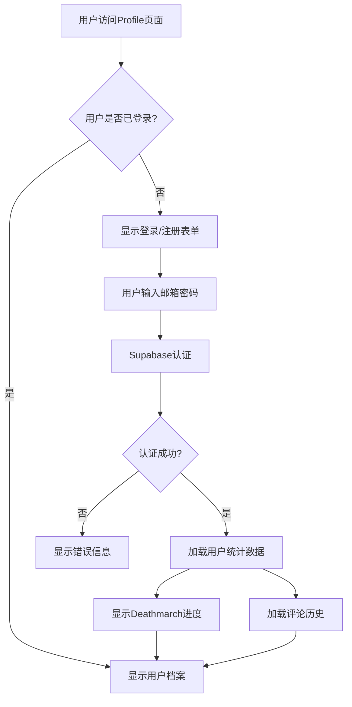
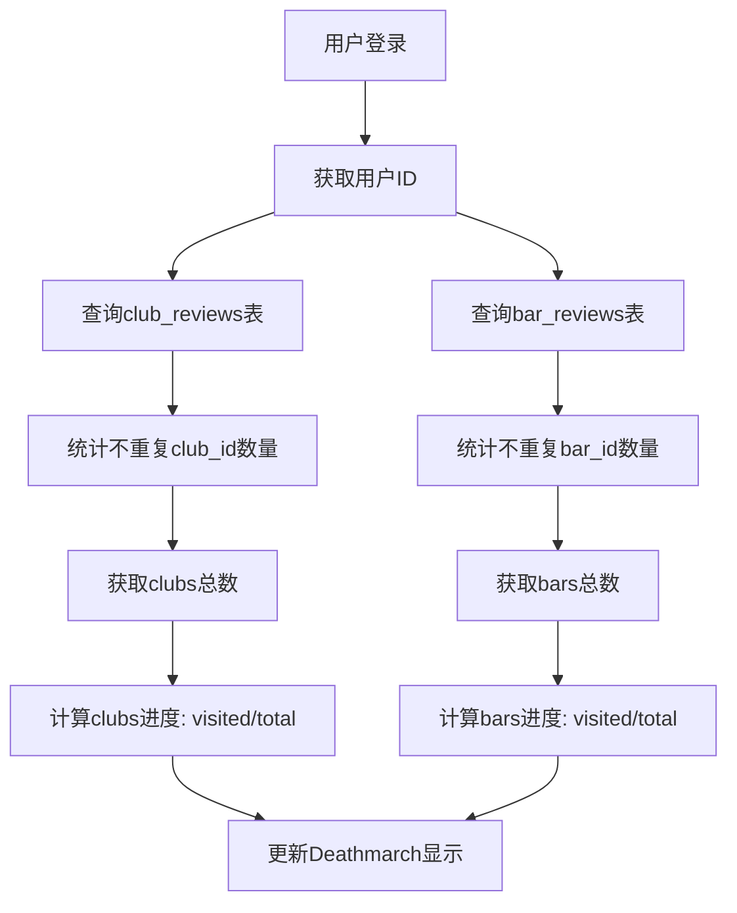

# 🌃 RAVEN - Berlin Nightlife Discovery Platform

<div align="center">
  
  
  **Discover. Experience. Transcend.**
  
  *The ultimate platform for exploring Berlin's underground nightlife scene*

  [](https://reactjs.org/)
  [](https://www.typescriptlang.org/)
  [](https://supabase.com/)
  [](https://tailwindcss.com/)
  [](https://vitejs.dev/)

</div>

---

## 📖 项目简介

**RAVEN** 是一个专为柏林夜生活文化打造的现代化 Web 应用程序，为用户提供沉浸式的俱乐部和酒吧发现体验。项目采用诗意化的设计语言，将传统的场所评价系统重新构想为一个充满情感共鸣的数字化夜生活生态系统。

### 🎯 核心愿景
- **Discover**: 探索柏林最具特色的夜生活场所
- **Experience**: 记录和分享真实的夜生活体验
- **Transcend**: 通过"Deathmarch"进度系统激励用户探索更多场所

### 🛠️ 技术栈

#### 前端技术
- **React 18.3+** - 现代化用户界面框架
- **TypeScript 5.0+** - 类型安全的 JavaScript 超集
- **Vite** - 高性能前端构建工具
- **Tailwind CSS** - 实用优先的 CSS 框架
- **Framer Motion** - 流畅的动画库
- **React Router** - 客户端路由管理
- **Lucide React** - 现代图标库

#### 后端与数据库
- **Supabase** - 全栈后端即服务平台
  - PostgreSQL 数据库
  - 实时数据同步
  - 用户认证与授权
  - Row Level Security (RLS)
  - 自动 API 生成

#### 开发工具
- **ESLint** - 代码质量检查
- **PostCSS** - CSS 后处理器
- **Git** - 版本控制系统

---

## ✨ 核心功能与亮点

### 🎵 场所发现系统
- **双重分类**: 支持 Clubs 和 Bars 两种场所类型
- **智能过滤**: 基于地区、主题、风格的多维度过滤
- **动态评分**: 基于用户评论的实时评分系统
- **标签系统**: 丰富的主题分类（音乐、氛围、建筑、饮品等）

**目标用户**: 柏林夜生活爱好者、游客、当地居民
**解决问题**: 信息分散、缺乏可信评价、难以发现新场所

### 🌟 用户评价系统
- **匿名评论**: 保护用户隐私的匿名评价机制
- **多维度评分**: 
  - Clubs: Music, Vibe, Crowd, Safety (0-100分制)
  - Bars: Quality, Vibe, Price, Friendliness (0-100分制)
- **优化更新**: 提交评论后立即在详情页显示
- **评分聚合**: 自动计算场所的平均评分

**目标用户**: 有夜生活经验的用户
**解决问题**: 缺乏真实评价、评分维度单一

### 🏆 Deathmarch 进度系统
- **游戏化体验**: "每个访问的场所都让你更接近超越"
- **动态统计**: 实时显示用户访问进度 (例: 5/128 clubs, 12/342 bars)
- **成就感**: 激励用户探索更多场所

**目标用户**: 重度夜生活用户、收集爱好者
**解决问题**: 缺乏持续探索动机

### 📱 个人档案系统 (ID)
- **简约身份**: 重新定义用户资料概念
- **Echo 记忆**: 分页展示用户评论历史
- **Graveyard 归档**: 收藏和历史记录管理
- **实时统计**: 动态展示个人夜生活足迹

**目标用户**: 所有注册用户
**解决问题**: 传统用户资料页面缺乏吸引力

### 🔒 安全与隐私
- **Supabase 认证**: 安全的用户注册和登录
- **匿名评论**: 保护用户身份隐私
- **Row Level Security**: 数据库级别的权限控制
- **数据加密**: 敏感信息安全存储

**目标用户**: 所有用户
**解决问题**: 隐私泄露风险、数据安全

---

## 📁 目录结构

```
E:\RAVEN\
├── public/                     # 静态资源文件
│   ├── favicon.ico            # 网站图标
│   └── index.html             # HTML 模板
├── src/                       # 源代码目录
│   ├── components/            # 可复用组件
│   │   ├── ui/               # 基础 UI 组件
│   │   │   ├── Button.tsx    # 按钮组件
│   │   │   ├── Card.tsx      # 卡片组件
│   │   │   └── Badge.tsx     # 标签组件
│   │   ├── Avatar.tsx        # 头像组件
│   │   ├── Navigation.tsx    # 导航组件
│   │   ├── RatingBar.tsx     # 评分条组件
│   │   ├── VibeCard.tsx      # 氛围卡片组件
│   │   └── WordStreamReviews.tsx # 评论流组件
│   ├── contracts/            # 类型定义
│   │   └── types.ts          # TypeScript 类型接口
│   ├── lib/                  # 工具库
│   │   ├── supabase.ts       # Supabase 客户端配置
│   │   └── utils.ts          # 通用工具函数
│   ├── routes/               # 路由页面
│   │   ├── Landing.tsx       # 首页
│   │   ├── Core.tsx          # 核心功能页
│   │   ├── Clubs.tsx         # 俱乐部列表页
│   │   ├── ClubDetail.tsx    # 俱乐部详情页
│   │   ├── Bars.tsx          # 酒吧列表页
│   │   ├── BarDetail.tsx     # 酒吧详情页
│   │   ├── Profile.tsx       # 用户档案页
│   │   └── SubmitReview.tsx  # 评论提交页
│   ├── services/             # 业务逻辑层
│   │   ├── clubsService.ts   # 俱乐部相关服务
│   │   ├── barsService.ts    # 酒吧相关服务
│   │   ├── reviewsService.ts # 评论相关服务
│   │   ├── vibeService.ts    # 氛围相关服务
│   │   └── favoritesService.ts # 收藏相关服务
│   ├── styles/               # 样式文件
│   │   ├── index.css         # 全局样式
│   │   └── raven-bottom-nav.css # 底部导航样式
│   ├── App.tsx               # 主应用组件
│   └── main.tsx              # 应用入口文件
├── sql/                      # 数据库脚本
│   ├── bars_v2_00_create_all_bar_tables.sql # 酒吧相关表创建
│   ├── bars_v2_01_create_bars_table.sql     # 酒吧主表
│   ├── bars_v2_02_create_bar_ratings_table.sql # 酒吧评分表
│   ├── bars_v2_03_create_bar_reviews_table.sql # 酒吧评论表
│   ├── bars_v2_04_extend_themes_table.sql      # 主题表扩展
│   ├── bars_v2_05_create_bar_themes_table.sql  # 酒吧主题关联表
│   ├── bars_v2_06_create_bar_locations_table.sql # 酒吧位置表
│   ├── bars_v2_07_seed_data.sql               # 种子数据
│   └── bars_v2_08_fix_view_rls.sql            # 视图权限修复
├── .env                      # 环境变量配置
├── .gitignore               # Git 忽略文件
├── package.json             # 项目依赖配置
├── tsconfig.json            # TypeScript 配置
├── tailwind.config.js       # Tailwind CSS 配置
├── vite.config.ts           # Vite 构建配置
├── CLAUDE.md                # 项目开发指南
├── BARS_ARCHITECTURE.txt    # 酒吧功能架构文档
└── README.md                # 项目说明文档
```

### 目录职责说明

- **`/components`**: 可复用的 React 组件，按功能分类
- **`/routes`**: 应用的主要页面组件，对应不同路由
- **`/services`**: 业务逻辑层，处理数据获取和操作
- **`/contracts`**: TypeScript 类型定义，确保类型安全
- **`/lib`**: 工具函数和第三方库配置
- **`/sql`**: 数据库结构和初始化脚本
- **`/styles`**: 自定义样式文件

---

## 🚀 安装与运行

### 系统要求

- **Node.js**: 16.0+ (推荐 18.0+)
- **npm**: 8.0+ 或 **yarn**: 1.22+
- **Git**: 版本控制工具
- **现代浏览器**: Chrome 90+, Firefox 90+, Safari 14+

### 环境依赖

- **Supabase 账户**: 用于后端服务
- **PostgreSQL**: 通过 Supabase 提供

### 安装步骤

#### 1. 克隆仓库
```bash
git clone <repository-url>
cd RAVEN
```

#### 2. 安装依赖
```bash
npm install
# 或
yarn install
```

#### 3. 环境变量配置
复制环境变量模板并配置：
```bash
cp .env.example .env
```

在 `.env` 文件中配置以下变量：
```env
VITE_SUPABASE_URL=your_supabase_project_url
VITE_SUPABASE_ANON_KEY=your_supabase_anon_key
```

#### 4. 数据库初始化
执行 SQL 脚本创建数据库结构：
```bash
# 在 Supabase SQL Editor 中依次执行 sql/ 目录下的脚本
# 建议按文件名顺序执行：
# 1. bars_v2_00_create_all_bar_tables.sql
# 2. bars_v2_08_fix_view_rls.sql
```

### 启动命令

#### 开发环境
```bash
npm run dev
# 或
yarn dev
```
访问: http://localhost:5173

#### 生产构建
```bash
npm run build
# 或
yarn build
```

#### 预览生产版本
```bash
npm run preview
# 或
yarn preview
```

#### 代码检查
```bash
npm run lint
# 或
yarn lint
```

---

## 🔧 环境变量

### 必需变量

| 变量名 | 描述 | 获取方式 | 示例 |
|--------|------|----------|------|
| `VITE_SUPABASE_URL` | Supabase 项目 URL | Supabase Dashboard > Settings > API | `https://xxxxx.supabase.co` |
| `VITE_SUPABASE_ANON_KEY` | Supabase 匿名密钥 | Supabase Dashboard > Settings > API | `eyJhbGci...` |

### 获取步骤

1. **注册 Supabase 账户**: https://supabase.com/
2. **创建新项目**: 选择地区和数据库密码
3. **获取 API 凭据**: 
   - 进入项目 Dashboard
   - 导航到 Settings > API
   - 复制 Project URL 和 anon public key
4. **配置环境变量**: 将凭据添加到 `.env` 文件

### 安全注意事项

- **不要提交** `.env` 文件到版本控制
- **仅使用** `anon` 密钥，不要使用 `service_role` 密钥
- **启用 RLS**: 确保 Supabase 中的 Row Level Security 已启用

---

## 🗄️ 数据库结构

### 核心数据表

#### 场所相关表

##### `clubs` - 俱乐部主表
```sql
- id: BIGSERIAL PRIMARY KEY
- name: TEXT NOT NULL
- description: TEXT
- district_id: BIGINT (FK to districts)
- created_at: TIMESTAMPTZ DEFAULT NOW()
```

##### `bars` - 酒吧主表
```sql
- id: BIGSERIAL PRIMARY KEY
- name: TEXT NOT NULL
- description: TEXT
- district_id: BIGINT (FK to districts)
- cash_only: BOOLEAN DEFAULT FALSE
- card_accepted: BOOLEAN DEFAULT TRUE
- created_at: TIMESTAMPTZ DEFAULT NOW()
```

##### `districts` - 地区表
```sql
- id: BIGSERIAL PRIMARY KEY
- name: TEXT UNIQUE NOT NULL
- description: TEXT
```

#### 评分与评论表

##### `club_reviews` - 俱乐部评论表
```sql
- id: BIGSERIAL PRIMARY KEY
- club_id: BIGINT NOT NULL (FK to clubs)
- user_id: UUID (FK to auth.users)
- music_rating: DECIMAL(2,1) (0-5)
- vibe_rating: DECIMAL(2,1) (0-5)
- crowd_rating: DECIMAL(2,1) (0-5)
- safety_rating: DECIMAL(2,1) (0-5)
- review_text: TEXT
- queue_time: INTEGER
- created_at: TIMESTAMPTZ DEFAULT NOW()
```

##### `bar_reviews` - 酒吧评论表
```sql
- id: BIGSERIAL PRIMARY KEY
- bar_id: BIGINT NOT NULL (FK to bars)
- user_id: UUID (FK to auth.users)
- quality_rating: INTEGER (0-100)
- price_rating: INTEGER (0-100)
- vibe_rating: INTEGER (0-100)
- friendliness_rating: INTEGER (0-100)
- review_text: TEXT
- queue_time: INTEGER
- created_at: TIMESTAMPTZ DEFAULT NOW()
```

#### 主题与标签系统

##### `themes` - 主题表
```sql
- id: BIGSERIAL PRIMARY KEY
- name: TEXT UNIQUE NOT NULL
- category: TEXT (drinks, style, architecture, vibe, music)
- created_at: TIMESTAMPTZ DEFAULT NOW()
```

##### `bar_themes` - 酒吧主题关联表
```sql
- id: BIGSERIAL PRIMARY KEY
- bar_id: BIGINT NOT NULL (FK to bars)
- theme_id: BIGINT NOT NULL (FK to themes)
- created_at: TIMESTAMPTZ DEFAULT NOW()
- UNIQUE(bar_id, theme_id)
```

#### 位置信息表

##### `bar_locations` - 酒吧位置表
```sql
- id: BIGSERIAL PRIMARY KEY
- bar_id: BIGINT NOT NULL (FK to bars)
- address_line: TEXT
- latitude: DECIMAL(10,8)
- longitude: DECIMAL(11,8)
- created_at: TIMESTAMPTZ DEFAULT NOW()
```

#### 收藏系统表

##### `favorites` - 收藏表
```sql
- id: BIGSERIAL PRIMARY KEY
- user_id: UUID NOT NULL (FK to auth.users)
- venue_id: TEXT NOT NULL
- venue_type: TEXT NOT NULL (club/bar)
- created_at: TIMESTAMPTZ DEFAULT NOW()
- UNIQUE(user_id, venue_id, venue_type)
```

### 数据库视图

##### `themes_by_category` - 主题分类视图
```sql
CREATE VIEW themes_by_category WITH (security_invoker = true) AS
SELECT 
    category,
    array_agg(name ORDER BY name) as theme_names,
    array_agg(id ORDER BY name) as theme_ids
FROM themes 
WHERE category IS NOT NULL
GROUP BY category;
```

##### `bar_themes_detailed` - 酒吧主题详情视图
```sql
CREATE VIEW bar_themes_detailed WITH (security_invoker = true) AS
SELECT 
    bt.bar_id,
    b.name as bar_name,
    bt.theme_id,
    t.name as theme_name,
    t.category as theme_category
FROM bar_themes bt
JOIN bars b ON bt.bar_id = b.id
JOIN themes t ON bt.theme_id = t.id;
```

### 表关系图 (ER 图概述)

```
Users (Supabase Auth)
    ↓ (1:N)
Reviews (club_reviews, bar_reviews)
    ↓ (N:1)
Venues (clubs, bars)
    ↓ (N:1)
Districts
    ↑
Venues ←→ Themes (N:N via bar_themes)
    ↓ (1:N)
Locations (bar_locations)

Users ←→ Venues (N:N via favorites)
```

### 索引策略

#### 性能优化索引
```sql
-- 评论表索引
CREATE INDEX idx_club_reviews_club_id ON club_reviews(club_id);
CREATE INDEX idx_club_reviews_user_id ON club_reviews(user_id);
CREATE INDEX idx_bar_reviews_bar_id ON bar_reviews(bar_id);
CREATE INDEX idx_bar_reviews_user_id ON bar_reviews(user_id);

-- 主题关联索引
CREATE INDEX idx_bar_themes_bar_id ON bar_themes(bar_id);
CREATE INDEX idx_bar_themes_theme_id ON bar_themes(theme_id);
CREATE INDEX idx_themes_category ON themes(category);

-- 收藏表索引
CREATE INDEX idx_favorites_user_id ON favorites(user_id);
CREATE INDEX idx_favorites_venue ON favorites(venue_id, venue_type);
```

### 数据约束

#### 评分约束
```sql
-- 酒吧评分范围 (0-100)
ALTER TABLE bar_reviews ADD CONSTRAINT chk_quality_rating 
    CHECK (quality_rating >= 0 AND quality_rating <= 100);
ALTER TABLE bar_reviews ADD CONSTRAINT chk_price_rating 
    CHECK (price_rating >= 0 AND price_rating <= 100);
ALTER TABLE bar_reviews ADD CONSTRAINT chk_vibe_rating 
    CHECK (vibe_rating >= 0 AND vibe_rating <= 100);
ALTER TABLE bar_reviews ADD CONSTRAINT chk_friendliness_rating 
    CHECK (friendliness_rating >= 0 AND friendliness_rating <= 100);

-- 俱乐部评分范围 (0-5)
ALTER TABLE club_reviews ADD CONSTRAINT chk_music_rating 
    CHECK (music_rating >= 0 AND music_rating <= 5);
-- (类似的约束应用于其他评分字段)
```

### Row Level Security (RLS) 策略

#### 公共读取策略
```sql
-- 允许所有用户查看场所信息
CREATE POLICY "Allow public read access" ON clubs FOR SELECT USING (true);
CREATE POLICY "Allow public read access" ON bars FOR SELECT USING (true);
CREATE POLICY "Allow public read access" ON themes FOR SELECT USING (true);
CREATE POLICY "Allow public read access" ON districts FOR SELECT USING (true);

-- 允许查看所有评论 (匿名)
CREATE POLICY "Allow public read access" ON club_reviews FOR SELECT USING (true);
CREATE POLICY "Allow public read access" ON bar_reviews FOR SELECT USING (true);
```

#### 用户写入策略
```sql
-- 只允许认证用户创建评论
CREATE POLICY "Users can create reviews" ON club_reviews 
    FOR INSERT WITH CHECK (auth.uid() IS NOT NULL);
CREATE POLICY "Users can create reviews" ON bar_reviews 
    FOR INSERT WITH CHECK (auth.uid() IS NOT NULL);

-- 用户只能修改自己的收藏
CREATE POLICY "Users can manage own favorites" ON favorites 
    FOR ALL USING (auth.uid() = user_id);
```

---

## 🧩 前端组件架构

### 基础 UI 组件

#### `Button.tsx` - 按钮组件
```typescript
interface ButtonProps {
  variant?: 'default' | 'ghost' | 'outline';
  size?: 'sm' | 'md' | 'lg';
  isLoading?: boolean;
  disabled?: boolean;
  className?: string;
  children: React.ReactNode;
  onClick?: () => void;
}
```
**功能**: 统一的按钮样式和交互逻辑
**特性**: 多种变体、加载状态、禁用状态

#### `Card.tsx` - 卡片组件
```typescript
interface CardProps {
  hover?: boolean;
  className?: string;
  children: React.ReactNode;
}
```
**功能**: 内容容器，提供统一的卡片样式
**特性**: 可选悬停效果、自定义样式

#### `Badge.tsx` - 标签组件
```typescript
interface BadgeProps {
  variant?: 'default' | 'raven' | 'outline';
  size?: 'sm' | 'md';
  onClick?: () => void;
  children: React.ReactNode;
}
```
**功能**: 显示标签、分类、状态信息
**特性**: 多种样式变体、可点击交互

### 业务组件

#### `RatingBar.tsx` - 评分条组件
```typescript
interface RatingBarProps {
  label: string;
  value: number; // 0-100
  showValue?: boolean;
}
```
**功能**: 可视化显示评分数据
**特性**: 动态颜色、渐变效果

#### `VibeCard.tsx` - 氛围卡片组件
```typescript
interface VibeCardProps {
  summary: VibeSummary;
}
```
**功能**: 显示场所当前氛围信息
**特性**: 实时数据、视觉化呈现

#### `Navigation.tsx` - 导航组件
```typescript
interface NavigationProps {
  currentPath: string;
}
```
**功能**: 底部导航栏
**特性**: 触摸优化、路由状态管理

### 状态管理策略

#### 本地状态管理
- **React useState**: 组件内部状态
- **React useEffect**: 副作用处理
- **React useContext**: 跨组件状态共享

#### 数据获取策略
- **服务层抽象**: 通过 services/ 目录统一数据访问
- **Promise 并发**: 使用 Promise.all 优化加载性能
- **乐观更新**: 评论提交后立即更新 UI

#### 缓存策略
- **本地存储**: 用户偏好设置
- **内存缓存**: 场所列表、主题数据
- **Supabase 实时**: 自动数据同步

---

## 🎨 设计系统

### Berlin-Themed Color Palette

绿色符号是 **#8ACE00** (raven 主题色)！

```css
:root {
  --berlin-black: #0B0B0B;  /* Primary dark background */
  --carbon: #101214;        /* Secondary background */
  --ink: #EDEDED;          /* Primary text */
  --ash: #9CA3AF;          /* Secondary text */
  --blood: #D0021B;        /* Accent/error color */
  --raven: #8ACE00;        /* Brand green accent */
}
```

### 视觉效果与动画

- **Scanline Animation** - CRT屏幕效果
- **Glitch Button Effects** - 赛博朋克风格
- **3D Card Transforms** - 透视旋转效果
- **Floating Smoke Animations** - 有机浮动绿色光球
- **WordStream Animation** - 物理基础浮动文本
- **Dark Theme** - 一致的柏林夜生活美学

---

## 🔄 核心业务流程

### 用户注册与认证流程



### 场所评论提交流程

```mermaid
flowchart TD
    A[用户点击"Add Review"按钮] --> B{用户是否已登录?}
    B -->|否| C[跳转到登录页面]
    B -->|是| D[进入评论提交页面]
    D --> E[用户填写评分和评论]
    E --> F[提交表单]
    F --> G{场所类型判断}
    G -->|Club| H[调用createReview]
    G -->|Bar| I[调用createBarReview]
    H --> J[保存到club_reviews表]
    I --> K[保存到bar_reviews表]
    J --> L[创建乐观更新Review]
    K --> L
    L --> M[导航回详情页面]
    M --> N[立即显示新评论]
    N --> O[重新计算场所评分]
```

### Deathmarch 进度更新流程



---

## 🚀 部署与运维

### 部署平台

#### 推荐部署平台
1. **Vercel** (推荐)
   - 零配置部署
   - 自动CI/CD
   - 边缘网络优化
   - 与GitHub无缝集成

2. **Netlify**
   - 简单部署流程
   - 表单处理
   - CDN加速

#### 部署配置

##### Vercel部署
```bash
# 安装Vercel CLI
npm i -g vercel

# 部署到Vercel
vercel

# 生产环境部署
vercel --prod
```

##### 环境变量配置
在部署平台中配置以下环境变量：
```
VITE_SUPABASE_URL=your_production_supabase_url
VITE_SUPABASE_ANON_KEY=your_production_anon_key
```

### 监控与日志

#### 性能监控
- **Vercel Analytics**: 页面性能和访问统计
- **Google Analytics**: 用户行为分析
- **Web Vitals**: 核心性能指标监控

#### 错误追踪
- **Sentry**: 前端错误监控和报告
- **Supabase Logs**: 后端API调用日志

---

## 🔒 安全与权限控制

### 用户认证机制

#### Supabase Auth
```typescript
// 认证流程
const { data, error } = await supabase.auth.signInWithPassword({
  email: 'user@example.com',
  password: 'securePassword123'
});

// JWT Token管理
const { data: { session } } = await supabase.auth.getSession();
const token = session?.access_token;
```

### 权限控制矩阵

| 资源 | 匿名用户 | 注册用户 | 管理员 |
|------|----------|----------|--------|
| 查看场所 | ✅ | ✅ | ✅ |
| 查看评论 | ✅ | ✅ | ✅ |
| 提交评论 | ❌ | ✅ | ✅ |
| 收藏场所 | ❌ | ✅ | ✅ |
| 修改场所 | ❌ | ❌ | ✅ |
| 删除评论 | ❌ | ❌ | ✅ |

### Row Level Security (RLS) 策略

#### 公共数据访问
```sql
-- 场所信息公开可读
CREATE POLICY "Allow public read access on clubs" ON clubs
    FOR SELECT USING (true);

-- 评论信息公开可读
CREATE POLICY "Allow public read access on reviews" ON club_reviews
    FOR SELECT USING (true);
```

#### 用户数据保护
```sql
-- 用户只能创建评论（需认证）
CREATE POLICY "Users can create reviews" ON club_reviews
    FOR INSERT WITH CHECK (auth.uid() IS NOT NULL);

-- 用户只能管理自己的收藏
CREATE POLICY "Users can manage own favorites" ON favorites
    FOR ALL USING (auth.uid() = user_id);
```

---

## 🗺️ 未来规划 / Roadmap

### Phase 1: 核心功能完善 (Q2 2024)

#### 🧪 测试与质量保证
- [ ] **测试框架集成**: Vitest + React Testing Library
- [ ] **单元测试覆盖**: 组件和服务层测试 >80%
- [ ] **E2E测试**: 关键业务流程自动化测试
- [ ] **性能测试**: 页面加载速度优化

#### 📱 移动体验优化
- [ ] **PWA支持**: Service Worker + 离线缓存
- [ ] **触摸优化**: 手势导航和交互改进
- [ ] **性能优化**: 懒加载和代码分割
- [ ] **响应式设计**: 更好的移动端适配

#### 🔧 基础功能增强
- [ ] **搜索功能**: 场所名称和描述全文搜索
- [ ] **地图集成**: 场所位置可视化
- [ ] **照片上传**: 用户可上传场所照片
- [ ] **营业时间**: 显示场所开放时间信息

### Phase 2: 社交功能 (Q3 2024)

#### 👥 用户社交系统
- [ ] **用户关注**: 关注其他用户的评论动态
- [ ] **评论互动**: 点赞、回复评论功能
- [ ] **用户排行**: 基于贡献度的用户等级系统
- [ ] **徽章系统**: 成就徽章和里程碑奖励

#### 🎉 活动功能
- [ ] **活动发现**: 场所举办的特殊活动信息
- [ ] **活动日历**: 个人和场所活动日程
- [ ] **活动评价**: 针对特定活动的评分系统
- [ ] **朋友邀请**: 邀请朋友参加活动

### Phase 3: 智能化与个性化 (Q4 2024)

#### 🤖 AI推荐系统
- [ ] **个性化推荐**: 基于用户历史的场所推荐
- [ ] **相似用户**: 发现品味相似的用户
- [ ] **智能匹配**: AI匹配最适合的夜生活场所
- [ ] **趋势分析**: 夜生活趋势和热门场所分析

#### 🌐 多语言支持
- [ ] **国际化**: 德语、英语多语言切换
- [ ] **本地化**: 针对不同文化的界面适配
- [ ] **自动翻译**: 评论自动翻译功能

### Phase 4: 生态系统扩展 (2025)

#### 🏢 商家端功能
- [ ] **商家入驻**: 场所管理者注册和认证
- [ ] **场所管理**: 商家自主管理场所信息
- [ ] **数据分析**: 为商家提供客户洞察
- [ ] **营销工具**: 活动推广和优惠券系统

#### 🎵 内容生态
- [ ] **音乐集成**: Spotify/SoundCloud播放列表
- [ ] **视频内容**: 场所氛围视频分享
- [ ] **直播功能**: 场所实时直播

---

## 🤝 贡献指南

### 如何参与开发

#### 准备工作
1. **Fork仓库**: 在GitHub上fork本项目
2. **克隆代码**: `git clone <your-fork-url>`
3. **安装依赖**: `npm install`
4. **创建分支**: `git checkout -b feature/your-feature-name`

### 代码规范

#### TypeScript规范
```typescript
// ✅ 推荐
interface User {
  id: string;
  email: string;
  createdAt: Date;
}

const getUserById = async (id: string): Promise<User | null> => {
  try {
    const { data, error } = await supabase
      .from('users')
      .select('*')
      .eq('id', id)
      .single();
    
    return error ? null : data;
  } catch (error) {
    console.error('Failed to get user:', error);
    return null;
  }
};
```

#### Commit消息规范
```bash
# 功能添加
feat(bars): add bar favorites functionality

# 问题修复
fix(reviews): resolve rating calculation error

# 文档更新
docs(readme): update installation instructions
```

---

## 📄 许可协议

### MIT License

```
MIT License

Copyright (c) 2024 RAVEN Berlin Nightlife Platform

Permission is hereby granted, free of charge, to any person obtaining a copy
of this software and associated documentation files (the "Software"), to deal
in the Software without restriction, including without limitation the rights
to use, copy, modify, merge, publish, distribute, sublicense, and/or sell
copies of the Software, and to permit persons to whom the Software is
furnished to do so, subject to the following conditions:

The above copyright notice and this permission notice shall be included in all
copies or substantial portions of the Software.

THE SOFTWARE IS PROVIDED "AS IS", WITHOUT WARRANTY OF ANY KIND, EXPRESS OR
IMPLIED, INCLUDING BUT NOT LIMITED TO THE WARRANTIES OF MERCHANTABILITY,
FITNESS FOR A PARTICULAR PURPOSE AND NONINFRINGEMENT. IN NO EVENT SHALL THE
AUTHORS OR COPYRIGHT HOLDERS BE LIABLE FOR ANY CLAIM, DAMAGES OR OTHER
LIABILITY, WHETHER IN AN ACTION OF CONTRACT, TORT OR OTHERWISE, ARISING FROM,
OUT OF OR IN CONNECTION WITH THE SOFTWARE OR THE USE OR OTHER DEALINGS IN THE
SOFTWARE.
```

### 第三方许可

#### 主要依赖库许可
- **React**: MIT License
- **TypeScript**: Apache License 2.0
- **Vite**: MIT License
- **Tailwind CSS**: MIT License
- **Framer Motion**: MIT License
- **Lucide React**: ISC License
- **Supabase**: Apache License 2.0

---

## 📞 联系方式

### 项目维护

#### 联系方式
- **GitHub**: https://github.com/[username]/raven
- **项目主页**: https://raven-berlin.vercel.app
- **技术支持**: 通过GitHub Issues提交

### 问题报告
- **Bug报告**: GitHub Issues
- **功能请求**: GitHub Issues
- **安全问题**: [security@raven-berlin.com]

---

## 🎉 致谢

### 开源社区

感谢以下开源项目和社区的贡献：

#### 核心技术栈
- **[React Team](https://reactjs.org/)** - 现代化的用户界面框架
- **[Vercel](https://vercel.com/)** - 优秀的前端部署平台
- **[Supabase](https://supabase.com/)** - 强大的开源后端平台
- **[Tailwind CSS](https://tailwindcss.com/)** - 实用优先的CSS框架

#### 开发工具
- **[Vite](https://vitejs.dev/)** - 快速的前端构建工具
- **[TypeScript](https://www.typescriptlang.org/)** - 类型安全的JavaScript
- **[ESLint](https://eslint.org/)** - 代码质量检查工具
- **[Framer Motion](https://www.framer.com/motion/)** - 流畅的动画库

#### 设计资源
- **[Lucide](https://lucide.dev/)** - 美观的开源图标库
- **[Unsplash](https://unsplash.com/)** - 高质量的免费图片资源
- **[Google Fonts](https://fonts.google.com/)** - 免费的Web字体服务

### 柏林夜生活社区
- 感谢柏林当地的俱乐部和酒吧提供的场所信息
- 感谢夜生活爱好者们分享的真实体验
- 感谢柏林多元化的夜生活文化启发

---

<div align="center">

## 🌃 探索无限，体验超越

**RAVEN - 让每一夜都成为传奇**

Made with ❤️ in Berlin

[](https://github.com/username/raven)
[](https://github.com/username/raven)
[](https://github.com/username/raven/issues)
[](https://github.com/username/raven/blob/main/LICENSE)

**[🚀 Live Demo](https://raven-berlin.vercel.app)** | 
**[📖 Documentation](https://github.com/username/raven/wiki)** | 
**[🐛 Report Bug](https://github.com/username/raven/issues)** | 
**[✨ Request Feature](https://github.com/username/raven/issues)**

</div>

---

*最后更新: 2024年1月 | 版本: 1.0.0 | 文档版本: v1.0*